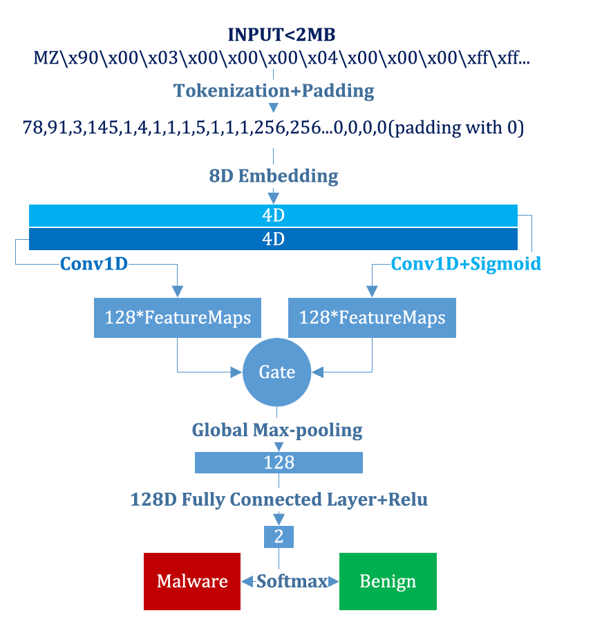
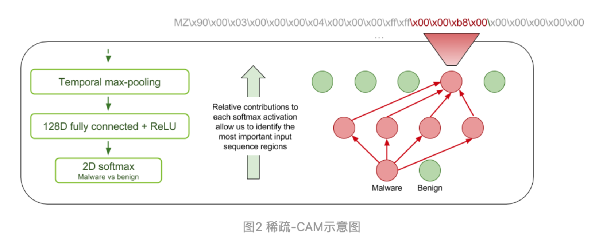

## MalConv-Pytorch
#### **A Pytorch implementation of MalConv**

+   [Integrated gradients applied to malware programs](https://captum.ai/tutorials/IMDB_TorchText_Interpret)

+   [Classifying Sequences of Extreme Length with Constant Memory Applied to Malware Detection](https://github.com/PowerLZY/Malconv-Pytorch)

+   [Neural Network Malware Binary Classification](https://github.com/jaketae/deep-malware-detection)

#### Research Work

#### 一、基于深度学习的恶意软件检测		

深度神经网络可以有效地挖掘原始数据中的潜在特征，而无需大量数据预处理和先验经验。神经网络在计算机视觉、语音识别和自然语言处理方面取得了一系列的成功，当然，成功的原因是多方面的，其中的一个因素就是神经网络具有从诸如像素或单个文本字符之类的原始数据中学习特征的能力。

+ **Malware Detection by Eating a Whole EXE（2018 AAAIW)**
+ Malware detection using 1-dimensional convolutional neural networks（ 2019 EuroS&PW）
+ **Lemna: Explaining deep learning based security applications（2018 CSS BP）**
  + 基于深度学习的安全应用提出高精度的解释，该方法提出了基于fused lasso增强的混合回归模型，解决了现有的解释技术无法处理特征依赖和非线性局部边界问题。LEMNA可以帮助安全分析人员用来理解分类器行为，排除分类错误等。
+ **Activation analysis of a byte based deep neural network for malware classification (2019 S&PW)**
  + Character-level Convolutional Networks for Text Classification (2015 NIPS) 
    + NLP预处理参考
  + **Explaining Vulnerabilities of Deep Learning to Adversarial Malware Binaries**
    + 对基于MalConv字节的恶意软件分类器进行了分析
    + 几乎所有对MalConv模型最有影响的激活都发生在PE文件的头中，这是因为它使用了一个单一的门卷积层和全局池。
  + ***TESSERACT: Eliminating Experimental Bias in Malware Classification across Space and Time （2019 S&P)***
      + **Video** https://www.youtube.com/watch?v=6INFR2AVWU0
+ **Adversarial Malware Binaries: Evading Deep Learning for Malware Detection in Executables**
  + **Malconv优化** 
  + 论文 https://arxiv.org/abs/2012.09390
  + 开发了一种新的时间最大池方法，使得所需的内存对序列长度T保持不变。这使得MalConv的内存效率提高了116倍，在原始数据集上训练的速度提高了25.8倍，同时**消除了MalConv的输入长度限制**
  + 复现 https://github.com/NeuromorphicComputationResearchProgram/MalConv2

#### 二、MalConv模型

**Malware Detection by Eating a Whole EXE（2018 AAAIW)**

+ **MalConv模型结构** [知乎链接](专家教你利用深度学习检测恶意代码 - 嘶吼RoarTalk的文章 - 知乎 https://zhuanlan.zhihu.com/p/32251097) [PE 结构 ](https://docs.microsoft.com/en-us/windows/desktop/debug/pe-format)[Github复现](https://github.com/PowerLZY/MalConv-Pytorch)
  
  
  
  + **计算量和内存用量能够根据序列长度而高效地扩展**
    + 我们能够通过使用门控卷积体系结构和可训练的输入字节的**嵌入向量**表示来最大化网络的可训练参数数量来实现了上面的第一个目标
    + 通过使用**更大的步幅和更大的卷积滤波器**大小来控制卷积层激活单元所占用的内存单元数量
  + **在检查整个文件的时候能同时考虑到本地和全局上下文**
    + 在卷积层后面添加了**全局最大池化层**
    + 一种解释方法是，门控卷积层能够识别恶意软件的本地指标，对全连接层最大池化处理后，使得系统能够评估整个文件中这些指标的相对强度，从而找出重要的全局组合
  + **在分析标记为恶意软件的时候能够提供更好的解释能力**
  
+ **挑战**

  + 恶意软件中的字节包含的信息具有**多态性**。上下文中的任何特定字节既可以表示为**人类可读的文本**，也可以表示为**二进制代码**或**任意对象（如图像等）**。此外，其中的某些内容可能是经过加密处理的，这样的话，它们对神经网络来说基本上就是随机的
  + 二进制文件的内容表现出多种类型的空间相关性。函数中的代码指令在空间上具有内在的相关性，但这种相关性与函数调用和跳转命令之间存在不连续性。
  + 将每个字节作为一个序列中的一个单元，我们处理的是一个200万时间步长的序列分类问题。据我们所知，这远远超过了以往任何基于神经网络的序列分类器的输入长度。为判别性特征非常稀疏的输入序列的所有两百万个时间步建立一个唯一的标签就成为一个极具挑战性的机器学习问题

+ **可解释性**

    + **类激活映射CAM**
    + 希望自己的神经网络对分类的结果具有一定的可解释性，以节约分析师的精力和时间。本文的思想是受到[Zhou et al. 2016]论文中的类激活映射（CAM）技术的启发而获得灵感的。对于良性和恶意软件中的每一个类别，我们都会为卷积层中最活跃的应用位置上每个过滤器的相对贡献生成一个映射。**[Learning Deep Features for Discriminative Localization (CVPR 2016)](https://link.zhihu.com/?target=https%3A//arxiv.org/abs/1512.04150)**

    

    +   积分梯度 ***Axiomatic Attribution for Deep Networks*** 
        + Captum

#### 三、Malconv-Adversarial 模型

+ **Adversarial Malware Binaries: Evading Deep Learning for Malware Detection in Executables**
  + https://github.com/yuxiaorun/MalConv-Adversarial
  + **第一篇攻击基于字节序列的白盒攻击算法**
  + 在文件末尾增加字节来产生对抗样本
+ **2020 Machine Learning Security Evasion Competition [github]**
  + 一个关于恶意软件对抗样本的比赛
+ **SecML Malware plupin**
  + **Partial DOS Header manipulation**, formulated by [Demetrio et al.](https://arxiv.org/abs/1901.03583)
    + Explaining Vulnerabilities of Deep Learning to Adversarial Malware Binaries
  + **Padding attack**, formulated by [Kolosnjaji et al.](http://pralab.diee.unica.it/sites/default/files/kolosnjaji18-eusipco.pdf)
    + Adversarial Malware Binaries: Evading Deep Learning for Malware Detection in Executables
  + **GAMMA**, formulated by [Demetrio et al.](https://arxiv.org/abs/2003.13526) 
    + Functionality-preserving Black-box Optimization of Adversarial Windows Malware
  + **FGSM padding + slack** formulated by [Kreuk et al.](https://arxiv.org/abs/1802.04528) and [Suciu et al.](https://arxiv.org/abs/1810.08280)
    + Deceiving End-to-End Deep Learning Malware Detectors using Adversarial Examples
    + Exploring Adversarial Examples in Malware Detection
  + **Content shifting and DOS header extension** formulated by [Demetrio et al.](https://arxiv.org/pdf/2008.07125.pdf)
    + **Adversarial EXEmples: A Survey and Experimental Evaluation of Practical Attacks on Machine Learning for Windows Malware Detection**

#### 四、针对对抗样本的防御方法

+   随机减少特征，对抗训练

+ Stateful Detection of Black-Box Adversarial Attacks （2016 abs）https://arxiv.org/abs/1907.05587
