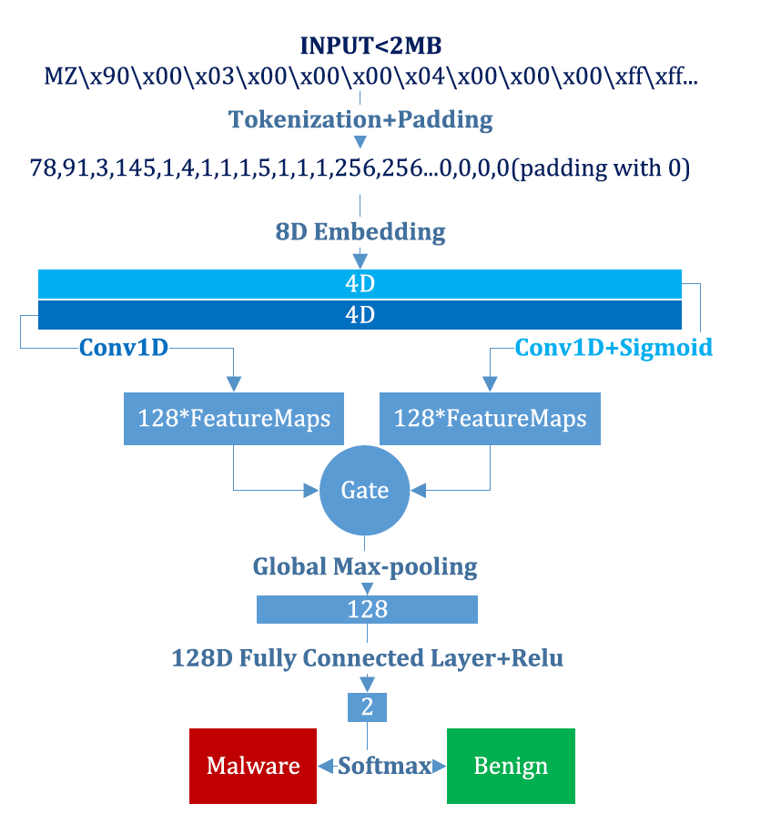
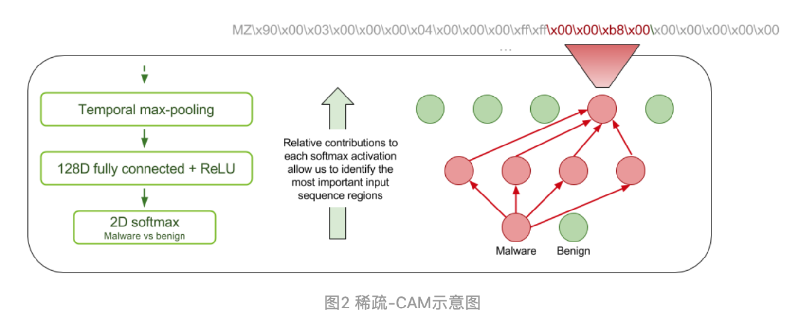

# MalConv-Pytorch
A Pytorch implementation of MalConv

- [x] 改写数据读取为 black/white 文件夹
- [x] 服务器保存模型
- [x] [Integrated gradients applied to malware programs](https://captum.ai/tutorials/IMDB_TorchText_Interpret)
- [ ] [复现 Classifying Sequences of Extreme Length with Constant Memory Applied to Malware Detection](https://github.com/PowerLZY/Malconv-Pytorch)
- [ ] 添加更多Malware样本
---
## Desciprtion

+ This is the implementation of MalConv proposed in [Malware Detection by Eating a Whole EXE](https://arxiv.org/abs/1710.09435).
+ This is the implementation of visualizing the integrated gradients applied to malware programs

## Setup

#### Preparing data

For the training data, please place PE files under [`data/train/`]() and build [the label table](data/example-train-label.csv) for training set with each row being

        <File Name>, <Label>

where label = 1 refers to malware. Validation set should be handled in the same way.

#### Training Log & Checkpoint

Log file, prediction on validation set & Model checkpoint will be stored at the path specified in config file.

#### Attributions

Show ``train_ data_path`` histogram graph and histogram of sample contribution.

#### Parameters & Model Options

For parameters and options availible, please refer to [`config/example.yaml`](config/example.yaml).

## Tips

#### TFRecord reader and writer

为了高效地读取数据，比较有帮助的一种做法是对数据进行序列化并将其存储在一组可线性读取的文件（每个文件 100-200MB）中。
这尤其适用于通过网络进行流式传输的数据。这种做法对缓冲任何数据预处理也十分有用。
TFRecord 格式是一种用于存储二进制记录序列的简单格式。
https://github.com/vahidk/tfrecord

## Research Work

#### 一、基于深度学习的恶意软件检测		

​		与特性空间不同的是，即使稍加修改，也**不能简单地更改原始二进制数据，否则会损坏其功能**。此外，二进制数据的大小差异很大，这进一步增加了攻击困难。我们同时发现在保存生成的对抗样本时，将连续空间中的对抗有效载荷转换回离散二进制时，会忽略细微的扰动，从而影响对抗攻击的有效性。因此，如何在保护原有功能的同时，对基于恶意软件二进制文件的深度学习模型进行有效而实用的黑盒攻击仍然是一个巨大的挑战。**原始二进制文件具有可变的输入大小**。

​		深度神经网络可以有效地挖掘原始数据中的潜在特征，而无需大量数据预处理和先验经验。

​		神经网络在计算机视觉、语音识别和自然语言处理方面取得了一系列的成功，当然，成功的原因是多方面的，其中的一个因素就是神经网络具有从诸如像素或单个文本字符之类的原始数据中**学习特征的能力**

+ Malware Detection by Eating a Whole EXE（2018 AAAIW)
+ Malware detection using 1-dimensional convolutional neural networks（ 2019 EuroS&PW）
  + **Lemna: Explaining deep learning based security applications**
+ **Activation analysis of a byte based deep neural network for malware classification (2019 S&PW)**
  + Character-level Convolutional Networks for Text Classification (2015 NIPS) 
    + NLP预处理参考
  + **Explaining Vulnerabilities of Deep Learning to Adversarial Malware Binaries**
    + 对基于MalConv字节的恶意软件分类器进行了分析
    + 几乎所有对MalConv模型最有影响的激活都发生在PE文件的头中，这是因为它使用了一个单一的门卷积层和全局池。
  + ***TESSERACT: Eliminating Experimental Bias in Malware Classification across Space and Time （2019 S&P)***
  + **Video** https://www.youtube.com/watch?v=6INFR2AVWU0
+ **Adversarial Malware Binaries: Evading Deep Learning for Malware Detection in Executables**
  + **Malconv优化**
  + 论文 https://arxiv.org/abs/2012.09390
  + 开发了一种新的时间最大池方法，使得所需的内存对序列长度T保持不变。这使得MalConv的内存效率提高了116倍，在原始数据集上训练的速度提高了25.8倍，同时**消除了MalConv的输入长度限制**
  + 复现 https://github.com/NeuromorphicComputationResearchProgram/MalConv2

------

#### 二、MalConv模型

**Malware Detection by Eating a Whole EXE（2018 AAAIW)**

+ **MalConv模型结构** [知乎链接](专家教你利用深度学习检测恶意代码 - 嘶吼RoarTalk的文章 - 知乎 https://zhuanlan.zhihu.com/p/32251097) [PE 结构 ](https://docs.microsoft.com/en-us/windows/desktop/debug/pe-format)[Github复现](https://github.com/PowerLZY/MalConv-Pytorch)
  + **计算量和内存用量能够根据序列长度而高效地扩展**
    + 我们能够通过使用门控卷积体系结构和可训练的输入字节的**嵌入向量**表示来最大化网络的可训练参数数量来实现了上面的第一个目标
    + 通过使用**更大的步幅和更大的卷积滤波器**大小来控制卷积层激活单元所占用的内存单元数量
  + **在检查整个文件的时候能同时考虑到本地和全局上下文**
    + 在卷积层后面添加了**全局最大池化层**
    + 一种解释方法是，门控卷积层能够识别恶意软件的本地指标，对全连接层最大池化处理后，使得系统能够评估整个文件中这些指标的相对强度，从而找出重要的全局组合
  + **在分析标记为恶意软件的时候能够提供更好的解释能力**

+ **挑战**

  + 恶意软件中的字节包含的信息具有**多态性**。上下文中的任何特定字节既可以表示为**人类可读的文本**，也可以表示为**二进制代码**或**任意对象（如图像等）**。此外，其中的某些内容可能是经过加密处理的，这样的话，它们对神经网络来说基本上就是随机的
  + 二进制文件的内容表现出多种类型的空间相关性。函数中的代码指令在空间上具有内在的相关性，但这种相关性与函数调用和跳转命令之间存在不连续性。
  + 将每个字节作为一个序列中的一个单元，我们处理的是一个200万时间步长的序列分类问题。据我们所知，这远远超过了以往任何基于神经网络的序列分类器的输入长度。

+ 为判别性特征非常稀疏的输入序列的所有两百万个时间步建立一个唯一的标签就成为一个极具挑战性的机器学习问题

+ 希望自己的神经网络对分类的结果具有一定的可解释性，以节约分析师的精力和时间。本文的思想是受到[Zhou et al. 2016]论文中的类激活映射（CAM）技术的启发而获得灵感的。对于良性和恶意软件中的每一个类别，我们都会为卷积层中最活跃的应用位置上每个过滤器的相对贡献生成一个映射。

  + **Learning Deep Features for Discriminative Localization. Zhou, B.; Khosla, A.; Lapedriza, A.; Oliva, A.; and Torralba, A. (CVPR 2016)** [https://arxiv.org/abs/1512.04150](https://link.zhihu.com/?target=https%3A//arxiv.org/abs/1512.04150)

  

+ 通过阅读已经发表的相关论文，我们发现，对于字节n-gram模型来说，几乎所有的判别性信息都是从可执行文件的头部中取得的。这意味着字节n-gram模型通常不使用文件的实际可执行代码或数据段作为判别性特征。表1中的结果表明，在我们的测试中，可以访问整个可执行文件的模型比仅限于文件头的模型具有更高的分类准确性。
+ 我们的恶意软件分析专家对224个随机选取的二进制文件的稀疏CAM进行分析的结果显示，在我们的模型获取的最重要的特征中，有39-42％的特征位于文件头之外。特别是，我们发现可执行代码和数据中都含有判别性特征

+ 神经网络无需借助昂贵和不可靠的特征工程就能学会如何区分良性和恶意的Windows可执行文件。这样一来，它不仅能够在进行分类时取得较高的AUC得分，还能够避免普通防病毒和恶意软件检测系统所面临的诸多问题。
+ **我们希望这项工作能够鼓励更多的机器学习社区来关注恶意软件检测，因为这一领域面临着许多独特的挑战，例如极长的序列和稀疏的训练信号，所以，对于研究人员来说，这将是一片沃土。**
+ **有些方法并不是在所有新的数据和问题领域都同样适用，例如batch正则化。**

#### 三、Malconv-Adversarial 模型

+ **Adversarial Malware Binaries: Evading Deep Learning for Malware Detection in Executables**
  + https://github.com/yuxiaorun/MalConv-Adversarial
  + 白盒
  + **第一篇攻击基于字节序列**
  + 在文件末尾增加字节来产生对抗样本
+ **2020 Machine Learning Security Evasion Competition [github]**
  + 一个关于恶意软件对抗样本的比赛
+ **SecML Malware plupin**
  + **Partial DOS Header manipulation**, formulated by [Demetrio et al.](https://arxiv.org/abs/1901.03583)
    + Explaining Vulnerabilities of Deep Learning to Adversarial Malware Binaries
  + **Padding attack**, formulated by [Kolosnjaji et al.](http://pralab.diee.unica.it/sites/default/files/kolosnjaji18-eusipco.pdf)
    + Adversarial Malware Binaries: Evading Deep Learning for Malware Detection in Executables
  + **GAMMA**, formulated by [Demetrio et al.](https://arxiv.org/abs/2003.13526) 
    + Functionality-preserving Black-box Optimization of Adversarial Windows Malware
  + **FGSM padding + slack** formulated by [Kreuk et al.](https://arxiv.org/abs/1802.04528) and [Suciu et al.](https://arxiv.org/abs/1810.08280)
    + Deceiving End-to-End Deep Learning Malware Detectors using Adversarial Examples
    + Exploring Adversarial Examples in Malware Detection
  + **Content shifting and DOS header extension** formulated by [Demetrio et al.](https://arxiv.org/pdf/2008.07125.pdf)
    + **Adversarial EXEmples: A Survey and Experimental Evaluation of Practical Attacks on Machine Learning for Windows Malware Detection**

#### 四、针对对抗样本的防御方法

+ Stateful Detection of Black-Box Adversarial Attacks （2016 abs）https://arxiv.org/abs/1907.05587

------

### 附录：

+ 积分梯度 ***Axiomatic Attribution for Deep Networks*** 
  + captum
